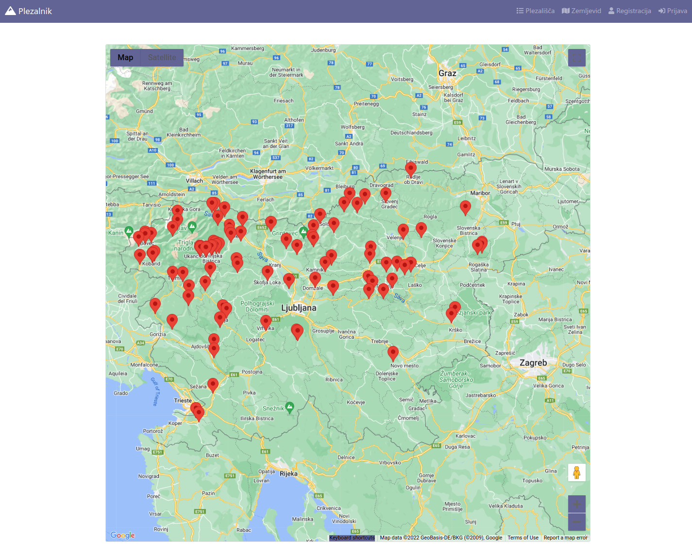
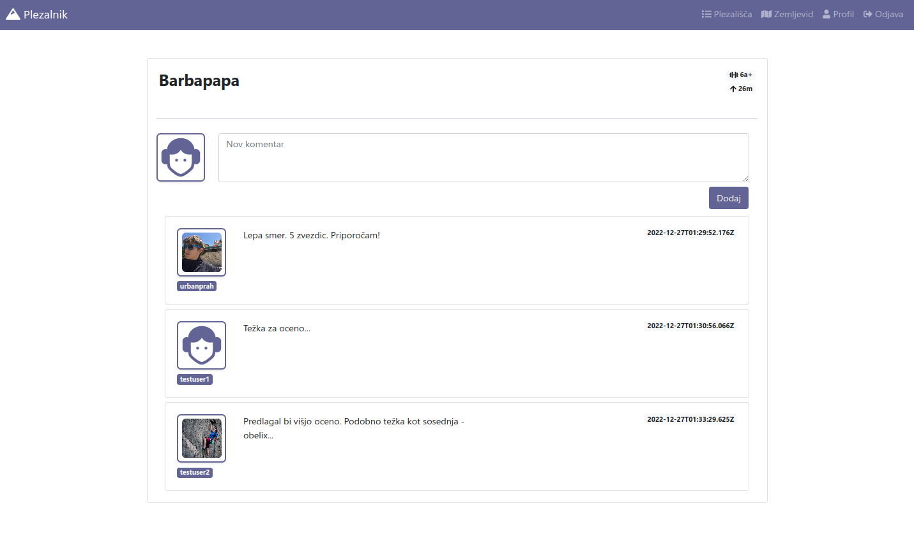

# <p align="center">Razvoj_in_Upravljanje_Programskih_Sistemov<p/>
## <p align="center">Spletna aplikacija za ogled plezalnih poti<p/>
Spletna aplikacija za ogled vseh plezalnih poti ter možnost komentiranja na teh poti, če je uporabnik prijavljen. Plezišča se enostavno razbere saj lahko uporabnik klikne na link in ga preusmeri na google maps kjer je tudi lokacija jasno prikazana. Plezališča tudi vsebujejo podrobne opise, ki jasno pripravijo uporabnika na pot, ki so jo zastavil, da bo opravil oziroma splezal.

<center>

</center>

## <p align="center">Kaj potrebujem za uspešno uporabo rešitve?<p/>
Za uspešen prenos ter vzpostavitev rešitve boste potrebovali pred inštaliran program node.js ter mongoDB. Priporočljiva je tudi uporabna intuitivnega urejevalnika kode, ki vam bo olajšal uporabo naše končne rešitve.

## <p align="center">Kako zaženem spletno aplikacijo?<p/>

> Prenos aplikacije in namestitev modulov
```sh
git clone https://github.com/FaricJure/Razvoj_in_Upravljanje_Programskih_Sistemov.git
cd Razvoj_in_Upravljanje_Programskih_Sistemov/
npm update
```

Za zapolnitev podatkovne baze je potrebana namestitev `MongoDB`.
S pomočjo orodja `MongoDB Compass` ustvarimo lokalno podatkovno bazo z imenom `rups` znotraj `localhost:27017`. Vanjo vstavimo kolekcijo: `crags`, v katero uvozimo podatke v obliki seznama json. Tega najdemo v `db/crags.json`

> Zagon aplikacije
```sh
node app.js
```
> Dostopna na http://localhost:3000
## <p align="center">Kaj je novega?<p/>
Najnovejša verzija zdaj še omogoča dodajanje komentarjev na objavah plezišč. Prav tako pa si lahko še dodatno personalizirate vaš profil z novo sliko prek katere vas lahko potem drugi prepoznajo.
                    
<center>

</center> 

----
